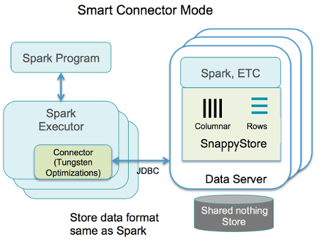

<a id="connectormode"></a>
# SnappyData Smart Connector Mode

In this mode, the Spark cluster executes in its own independent JVM processes and connects to SnappyData as a Spark data source. Conceptually, this is similar to how Spark applications work with stores like Cassandra, Redis etc. The Smart connector mode also implements several performance optimizations as described in this section.

Spark applications run as independent sets of processes on a cluster, coordinated by the SparkContext object in your main program (called the driver program).

Specifically, to run on a cluster, the SparkContext can connect to several types of cluster managers (either Spark’s own standalone cluster manager, Mesos or YARN), which allocate resources across applications. Once connected, Spark acquires executors on nodes in the cluster, which are processes that run computations and store data for your application. Next, it sends your application code (defined by JAR or Python files passed to SparkContext) to the executors. Finally, SparkContext sends tasks to the executors to run.



**Key Points:**

* Can work with SnappyData store from a compatible Spark distribution (2.1.1)

* Spark application executes in its own independent JVM processes

* The Spark application connects to SnappyData as a Spark Data source

* Supports any of the Spark supported resource managers (for example, Spark Standalone Manager, YARN or Mesos)

**Some of the advantages of this mode are:**

Performance</br>
When Spark partitions store data in **column tables**, the connector automatically attempts to localize the partitions into SnappyData store buckets on the local node. The connector uses the same column store format as well as compression techniques in Spark avoiding all data formatting related inefficiencies or unnecessary serialization costs. This is the fastest way to ingest data when Spark and the SnappyData cluster are operating as independent clusters.

When storing to **Row tables** or when the partitioning in Spark is different than the partitioning configured on the table, data batches could be shuffled across nodes. Whenever Spark applications are writing to SnappyData tables, the data is always batched for the highest possible throughput.

When queries are executed, while the entire query planning and execution is coordinated by the Spark engine (Catalyst), the smart connector still carries out a number of optimizations, which are listed below:

* Route jobs to same machines as SnappyData data nodes if the executor nodes are co-hosted on the same machines as the data nodes. Job for each partition tries to fetch only from same machine data store where possible.


* Colocated joins: If the underlying tables are colocated partition-wise, and executor nodes are co-hosting SnappyData data nodes, then the column batches are fetched from local machines and the join itself is partition-wise and does not require any exchange.


* Optimized column batch inserts like in the Embedded mode with job routing to same machines as data stores if possible.

<a id="example"></a>

**Example: Launch a Spark local mode cluster and use Smart Connector to access SnappyData cluster**

**Step 1: Start the SnappyData cluster**:
You can either start SnappyData members using the `snappy_start_all` script or you can start them individually.

**Step 2: Launch the Apache Spark program**

***_In the Local mode_***

```pre

./bin/spark-shell  --master local[*] --conf spark.snappydata.connection=localhost:1527 --packages "SnappyDataInc:snappydata:1.1.1-s_2.11"
```
!!! Note 
	*  The `spark.snappydata.connection` property points to the locator of a running SnappyData cluster. The value of this property is a combination of locator host and JDBC client port on which the locator listens for connections (default is 1527).
 
 	* In the Smart Connector mode, all `snappydata.*` SQL configuration properties should be prefixed with `spark`. For example, `spark.snappydata.column.batchSize`.

This opens a Scala Shell.

**Step 3: Import any or all of the following:** 

*	**SQL Context**
*	**SnappyContext**
*	**SnappySession**

```
import org.apache.spark.sql.{SQLContext,SnappyContext,SnappySession}
```

 This starts the SnappyData cluster with Smart Connector mode. Create a SnappySession to interact with the SnappyData store.

```pre
	// Create a SnappySession to work with SnappyData store
	$scala > val snSession = new SnappySession(spark.sparkContext)
```

The code example for writing a Smart Connector application program is located in [SmartConnectorExample](https://github.com/SnappyDataInc/snappydata/blob/master/examples/src/main/scala/org/apache/spark/examples/snappydata/SmartConnectorExample.scala)

***_Using External Cluster Manager_***

**Cluster mode**

```pre
./bin/spark-submit --deploy-mode cluster --class somePackage.someClass  --master spark://localhost:7077 --conf spark.snappydata.connection=localhost:1527 --packages "SnappyDataInc:snappydata:1.1.1-s_2.11"
```
**Client mode**
```pre
./bin/spark-submit --class somePackage.someClass  --master spark://localhost:7077 --conf spark.snappydata.connection=localhost:1527 --packages "SnappyDataInc:snappydata:1.1.1-s_2.11"
```


***_Using YARN as a Cluster Manager_***

**Cluster mode**
```pre
./spark-submit --master yarn  --deploy-mode cluster --conf spark.driver.extraClassPath=/home/snappyuser/snappydata-0.6-SNAPSHOT-bin/jars/* --conf spark.executor.extraClassPath=/home/snappyuser/snappydata-0.6-SNAPSHOT-bin/jars/* --class MainClass SampleProjectYarn.jar
```

**Client mode**
```pre
./spark-submit --master yarn  --deploy-mode client --conf spark.driver.extraClassPath=/home/snappyuser/snappydata-0.6-SNAPSHOT-bin/jars/* --conf spark.executor.extraClassPath=/home/snappyuser/snappydata-0.6-SNAPSHOT-bin/jars/* --class MainClass SampleProjectYarn.jar
```
