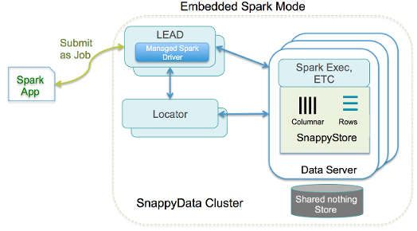

<a id="embeddedmode"></a>
# Embedded SnappyData Store Mode
In this mode, the Spark computations and in-memory data store run colocated in the same JVM. This is our out of the box configuration and suitable for most SnappyData real-time production environments. You launch SnappyData servers to bootstrap any data from disk, replicas or from external data sources.
Spark executors are dynamically launched when the first Spark Job arrives.

**Some of the advantages of this mode are:**

* **High performance**: All your Spark applications access the table data locally, in-process. The query engine accesses all the data locally by reference and avoids copying (which can be very expensive when working with large volumes).

* **Driver High Availability**: When Spark jobs are submitted, they can now run in an HA configuration. The submitted job becomes visible to a redundant “lead” node that prevents the executors to go down when the Spark driver fails. Any submitted Spark job continues to run as long as there is at least one “lead” node running.

* **Less complex**: There is only a single cluster to start, monitor, debug and tune.



In this mode, one can write Spark programs using jobs. For more details, refer to the [SnappyData Jobs](../programming_guide/snappydata_jobs.md) section.

**Example: Submit a Spark Job to the SnappyData Cluster**
```
./bin/snappy-job.sh submit --app-name JsonApp --class org.apache.spark.examples.snappydata.WorkingWithJson --app-jar examples/jars/quickstart.jar --lead [leadHost:port] --conf json_resource_folder=../../quickstart/src/main/resources
```

Also, you can use [SnappySQL](../howto/use_snappy_shell.md) to create and query tables.

You can either [start SnappyData members](../howto/start_snappy_cluster.md) using the `snappy-start-all.sh` script or you can start them individually.

Having the Spark computation embedded in the same JVM allows us to do a number of optimization at query planning level. For example:

* If the join expression matches the partitioning scheme of tables, a partition to partition join instead of a shuffle based join is done. </br> Moreover, if two tables are colocated (while defining the tables) costly data movement can be avoided.

* For replicated tables, that are present in all the data nodes, a simple local join (local look up)  is done instead of a broadcast join.

* Similarly inserts to tables groups rows according to table partitioning keys, and route to the JVM hosting the partition. This results in higher ingestion rate.

