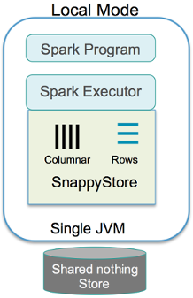

<a id="localmode"></a>
# Local Mode

In this mode, you can execute all the components (client application, executors, and data store) locally in the application's JVM. It is the simplest way to start testing and using SnappyData, as you do not require a cluster, and the  executor threads are launched locally for processing.

**Key Points**

* No cluster required

* Launch Single JVM (Single-node Cluster)

* Launches executor threads locally for processing

* Embeds the SnappyData in-memory store in-process

* For development purposes only
 


**Example: Using the Local mode for developing SnappyData programs**

You can use an IDE of your choice, and provide the below dependency to get SnappyData binaries:

**Example: Maven dependency**

```pre
<!-- https://mvnrepository.com/artifact/io.snappydata/snappydata-cluster_2.11 -->
<dependency>
    <groupId>io.snappydata</groupId>
    <artifactId>snappydata-cluster_2.11</artifactId>
    <version>1.2.0</version>
</dependency>
```

**Example: SBT dependency**

```pre
// https://mvnrepository.com/artifact/io.snappydata/snappydata-cluster_2.11
libraryDependencies += "io.snappydata" % "snappydata-cluster_2.11" % "1.2.0"
```

**Note**:</br>
If your project fails when resolving the above dependency (that is, it fails to download javax.ws.rs#javax.ws.rs-api;2.1), it may be due an issue with its pom file. </br>As a workaround, add the below code to the **build.sbt**:

```pre
val workaround = {
  sys.props += "packaging.type" -> "jar"
  ()
}
```

For more details, refer [https://github.com/sbt/sbt/issues/3618](https://github.com/sbt/sbt/issues/3618).

**Create SnappySession**:

To start SnappyData store you need to create a SnappySession in your program:

```pre
 val spark: SparkSession = SparkSession
         .builder
         .appName("SparkApp")
         .master("local[*]")
         .getOrCreate
 val snappy = new SnappySession(spark.sparkContext)
```
  
  
  
**Example**: **Launch Apache Spark shell and provide SnappyData dependency as a Spark package**:

If you already have Spark 2.1.1 installed in your local machine you can directly use `--packages` option to download the SnappyData binaries.

```pre
./bin/spark-shell --packages "SnappyDataInc:snappydata:1.2.0-s_2.11"
```
