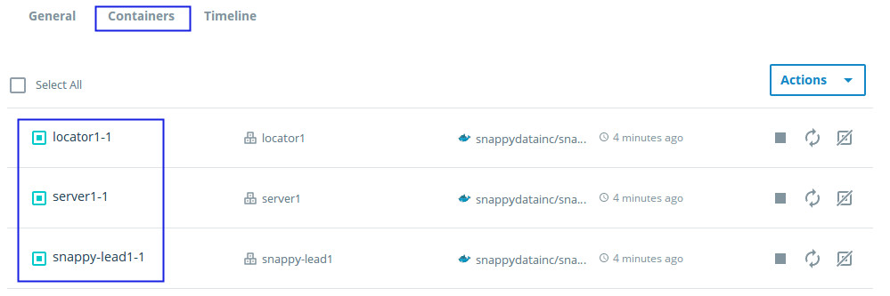

# Running SnappyData on Docker Cloud

Docker Cloud is Docker's official platform for building, managing and deploying Docker containers across a variety of Cloud providers. It also provides features ideal for development workflows.

To connect to the Cloud providers like AWS, AZURE and Digital Ocean refer to the official [Docker documentation](https://docs.docker.com/docker-cloud/infrastructure/link-aws/).

## Connect to the Cloud Hosting Provider

Using Docker Cloud, connect to a cloud hosting provider of your choice. Currently, Amazon Web Services, Digital Ocean, Microsoft Azure, Softlayer and Packet and BYOH (bring your own host) are supported.

1. Go to the [Docker Cloud](http://cloud.docker.com) page, and login using your Docker ID.

2. **Create a Node: ** 
 	
    a. From the left-pane, click **Nodes**. The **Nodes** page is displayed.
 		 

 	b. Click **Create** and provide the following information on the **Nodes Clusters / Wizard** page. 
		
 
	c. Based on your selection, additional fields are displayed. Enter the required information, and click **Launch node cluster**.
 	 
   
	d. It may take some time to create a node. The status is dislayed as **Deploying**. When the node is created, the status is updated to **Deployed**.

3. **Create Stacks:**

	a. In the left-pane, click **Stacks**. The **Stacks **page is displayed.
	 
 	
    b. Click **Create **. The **Stacks/Wizard** page is displayed.
	 
 
	c. Enter a name for the stack. 
 
	d. Copy and paste the sample code provided in the [**stack.yml **](https://raw.githubusercontent.com/SnappyDataInc/snappy-cloud-tools/master/docker/docker-cloud/stack.yml) file in the text box. This starts a locator, server and lead using the latest image provided by SnappyData.
		  

	e. Click **Create** to create the stack or click **Create & Deploy** to create and deploy the stack. If you click **Create**, you have to manually start the stack after it is created.

	f. The status of the list of the resulting services is displayed.
 Currently, the default strategy (emptiest node) used by Docker Cloud is used for load balancing. Based on your requirements, you can use from the strategies provided by Docker.

	g. To verify the status of the elements, click on **Nodes**, select a node, and then go to the **Containers** tab. The page displays the containers that are running.

	  

4. **Verify connection with snappy ** 
		
	a. Download the binary files from the [SnappyData repository](https://github.com/SnappyDataInc/snappydata/releases/download/v0.8/snappydata-0.8-bin.tar.gz) and go to the location of the **bin** directory in the SnappyData home directory.

	b. Using the command line client, connect to SnappyData and then start the snappy.

 		bin$ ./snappy
 		SnappyData version 0.8
 		snappy>
 		  	
    !!! Note: 
        	You can also connect to SnappyData with DB client tools like dbSchema, DBVisualizer or Squirrel SQL client using the **snappydata-store-client-1.5.0.jar** file available on the official [SnappyData Release page](#https://github.com/SnappyDataInc/snappydata/releases). Refer to the documentation provided by your client tool for instructions on how to make a JDBC connection.
 
5. **Make a JDBC connection**

	a. Click on the node you want to connect to. Use the details of the connection string to connect to the locator from your local machine.

  		$ snappy> connect client '<Your Machine IP>:1527';
  		Using CONNECTION0
  		snappy>
  		        
	b. Enter the following command followed by the URL of the JDBC connection.
 
  		snappy> connect client <connection string>
  		  
	c. You can also monitor the cluster by connecting to the SnappyData UI using the URL.
		 

!!! NOTE: 
	The document provides you basic instructions to set up a cluster using Docker Cloud. Depending on your needs, you can explore the full potential of SnappyData on Docker Cloud using the UI or CLI. Refer to the [Docker Cloud's documentation](https://docs.docker.com/docker-cloud/) and the [SnappyData documentation](http://snappydatainc.github.io/snappydata/) for more information.
