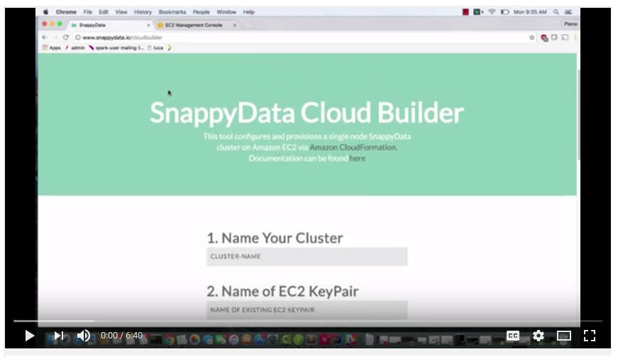
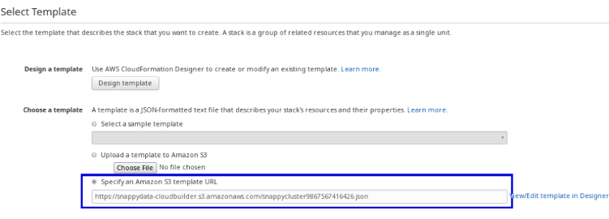

<a id="SettingUp"></a>
##Setting Up SnappyData Cloud Cluster##
This section discusses the steps required for setting up and deploying SnappyData Cloud Cluster on AWS using the iSight CloudBuilder and using a script.

<a id="DeployingClusterCloudFormation"></a>
###Deploying SnappyData Cloud Cluster with iSight CloudBuilder
Watch the following  video to learn how easy it is to use iSight CloudBuilder, which generates a SnappyData Cloud Cluster.

[](https://www.youtube.com/watch?v=jbudjTqWsdI&feature=youtu.be)

####Prerequisites
Before you begin:

* Ensure that you have an existing AWS account with required permissions to launch EC2 resources with CloudFormation
* Sign into the AWS console using your AWS account-specific URL. This ensures that the account-specific URL is stored as a cookie in the browser, which then redirects you to the appropriate AWS URL for subsequent logins.
* Create an EC2 Key Pair in the region where you want to launch the SnappyData Cloud cluster


SnappyData uses the AWS CloudFormation feature to automatically install, configure and start a SnappyData Cloud cluster. In this release, the configuration supports launching the cluster on a single EC2 instance.

It is recommended that you select an instance type with higher processing power and more memory for this cluster, as it would be running four processes (locator, lead, a data server and an Apache Zeppelin server) on it.

This method is recommended as the fastest way to deploy SnappyData. All you need is an existing AWS account and login credentials to get started! 

####Configuring and Launching the SnappyData Cloud Cluster

Launch the iSight CloudBuilder from [http://www.snappydata.io/cloudbuilder](http://www.snappydata.io/cloudbuilder). 

1. Enter the name for your cluster. Each cluster is identified by its unique name. 
The names and details of the members are automatically derived from the provided cluster name. <br>


2. Enter a name of an existing EC2 KeyPair. This enables SSH access to the cluster.
Refer to the Amazon documentation for more information on  [generating your own EC2 Key Pair](http://docs.aws.amazon.com/AWSEC2/latest/UserGuide/ec2-key-pairs.html).<br>


3. Select an instance based on the capacity that you require. 

 
4. Enter the size of the EBS storage volume to be attached to the Amazon EC2 instance in the **EBS Volume Size(gigabytes)** field.


	!!! Note
		Currently only Amazon Elastic Block Storage (EBS) is supported. 

5. Enter your email address.  <br>


6. Click **Generate**.

7. On the next page, select the AWS region, and then click **Launch Cluster** to launch your single-node cluster.

	!!! Note
		* The region you select must match the EC2 Key Pair you created.
		* If you are not already logged into AWS, you are redirected to the AWS sign-in page.
 

8. On the **Select Template page**, the URL for the Amazon S3 template is pre-populated. Click **Next** to continue.   <br>


9. You can change the stack name or click **Next** to use the provided default value.

	!!! Note
		The stack name must contain only letters, numbers, dashes and should start with an alpha character.

10. Specify the tags (key-value pairs) for resources in your stack or leave the field empty and click **Next**.

11. On the **Review** page, verify the details and click **Create** to create a stack.

	!!! Note
		This operation may take a few minutes to complete.

12. The next page lists the existing stacks. Click **Refresh** to view the updated list and the status of the stack creation.
When the cluster has started, the status of the stack changes to **CREATE_COMPLETE**. <br>

<a id="Stack"></a>
13. Click on the **Outputs** tab, to view the links (URL) required for launching Apache Zeppelin, which provides web-based notebooks for data exploration. <br>
	

	!!! Note
		If the status of the stack displays **ROLLBACK_IN_PROGRESS** or **DELETE_COMPLETE**, the stack creation may have failed. Some common problems that might have caused the failure are:
        
		* **Insufficient Permissions**: Verify that you have the required permissions for creating a stack (and other AWS resources) on AWS.
		* **Invalid Keypair**: Verify that the EC2 key pair exists in the region you selected in the iSight CloudBuilder creation steps.
		* **Limit Exceeded**: Verify that you have not exceeded your resource limit. For example, if you exceed the allocated limit of Amazon EC2 instances, the resource creation fails and an error is reported.

	!!! Note
		To stop incurring charges for the instance, you can either terminate the instance or delete the stack. You cannot connect to or restart an instance after you have terminated it.


For more information, refer to the [Apache Zeppelin](#LoggingZeppelin) section or refer to the [Apache Zeppelin documentation](http://zeppelin.apache.org/).

<a id="DeployingClusterScript"></a>
###Deploying SnappyData Cloud Cluster on AWS using Scripts

SnappyData provides a script that allows you to launch and manage SnappyData clusters on Amazon Elastic Compute Cloud (EC2).

Download the script from the latest [SnappyData Release page](https://github.com/SnappyDataInc/snappydata/releases).
The package is available in compressed files (**snappydata-ec2-`<version>`.tar.gz**). Extract the contents to a location on your computer.

####Prerequisites
Before you begin, do the following:

* Ensure that you have an existing AWS account with required permissions to launch EC2 resources.

* EC2 Key Pair is created in the region where you want to launch the SnappyData cluster.

* Using the AWS Secret Access Key and the Access Key ID, set the two environment variables, `AWS_SECRET_ACCESS_KEY` and `AWS_ACCESS_KEY_ID`.

	If you already have set up the AWS Command Line Interface on your local machine, the script automatically detects and uses the credentials from the AWS credentials file. You can find this information from the AWS IAM console.

	For example:<br/>
>```
export AWS_SECRET_ACCESS_KEY=abcD12efGH34ijkL56mnoP78qrsT910uvwXYZ1112
export AWS_ACCESS_KEY_ID=A1B2C3D4E5F6G7H8I9J10
>```

* Ensure Python v 2.7 or later is installed on your local computer.

####Launching SnappyData Cluster

In the command prompt, go to the directory where the **snappydata-ec2-`<version>`.tar.gz** is extracted or to the **aws/ec2** directory where the **snappy-cloud-tools** [repository](https://github.com/SnappyDataInc/snappy-cloud-tools) is cloned locally.

Enter the command in the following format:

```
./snappy-ec2 -k <your-key-name> -i <your-keyfile-path> <action> <your-cluster-name>
```

Here, `<your-key-name>` refers to the EC2 Key Pair, `<your-keyfile-path>` refers to the path to the key file and `<action>` refers to the action to be performed (for example, launch, start, stop).
 
By default, the script starts one instance of a locator, lead,  and server each. 
The script identifies each cluster by the unique cluster name (you provided) and internally ties members (locators, leads, and stores/servers) of the cluster with EC2 security groups.
 
The names and details of the members are automatically derived from the provided cluster name. 

For example, if you launch a cluster named **my-cluster**, the locator is available in security group named **my-cluster-locator** and the store/server are available in **my-cluster-store**.

When running the script you can also specify properties like the number of stores and region.
For example, using the following command, you can start a SnappyData cluster named **snappydata-cluster** with 2 stores (or servers) in the N. California (us-west-1) region on AWS. It also starts an Apache Zeppelin server on the instance where lead is running.

The examples below assume that you have the key file (my-ec2-key.pem) in your home directory for EC2 Key Pair named 'my-ec2-key'.

```
./snappy-ec2 -k my-ec2-key -i ~/my-ec2-key.pem --stores=2 --with-zeppelin=embedded --region=us-west-1 launch snappydata-cluster 
```
To start Apache Zeppelin on a separate instance, use `--with-zeppelin=non-embedded`. 

For a comprehensive list of command options, simply run `./snappy-ec2` in the command prompt.
