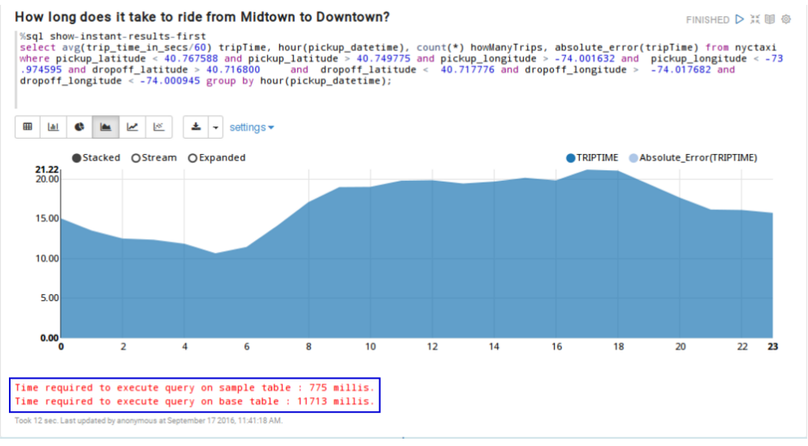

##Using the Interpreter##
SnappyData Interpreter group consists of the interpreters `%snappydata.spark` and `%snappydata.sql`.
To use an interpreter, add the associated interpreter directive with the format, `%<Interpreter_name>` at the beginning of a paragraph in your note. In a paragraph, use one of the interpreters, and then enter required commands.

!!! Note
	* The SnappyData Interpreter provides a basic auto-completion functionality. Press (Ctrl+.) on the keyboard to view a list of suggestions.

 	* It is recommended that you use the SQL interpreter to run queries on the SnappyData cluster, as an out of memory error may be reported with running the Scala interpreter.

###SQL Interpreter###
The `%snappydata.sql` code specifies the default SQL interpreter. This interpreter is used to execute SQL queries on SnappyData cluster.
####Multi-Line Statements####
Multi-line statements ,as well as multiple statements on the same line, are also supported as long as they are separated by a semicolon. However, only the result of the last query is displayed.

SnappyData provides a list of connection-specific SQL properties that can be applied to the paragraph that is executed. 

In the following example, `spark.sql.shuffle.partitions` allows you to specify the number of partitions to be used for this query:

```
%sql
set spark.sql.shuffle.partitions=6; 
select medallion,avg(trip_distance) as avgTripDist from nyctaxi group by medallion order by medallion desc limit 100 with error
```
####SnappyData Directives in Apache Zeppelin####
You can execute approximate queries on SnappyData cluster by using the `%sql show-instant-results-first` directive. 
In this case, the query is first executed on the sample table and the approximate result is displayed, after which the query is run on the base table. Once the query is complete, the approximate result is replaced with the actual result.

In the following example, you can see that the query is first executed on the sample table, and the time required to execute the query is displayed. 
At the same time, the query is executed on the base table, and the total time required to execute the query on the base table is displayed.
```
%sql show-instant-results-first
select avg(trip_time_in_secs/60) tripTime, hour(pickup_datetime), count(*) howManyTrips, absolute_error(tripTime) from nyctaxi where pickup_latitude < 40.767588 and pickup_latitude > 40.749775 and pickup_longitude > -74.001632 and  pickup_longitude < -73.974595 and dropoff_latitude > 40.716800 and  dropoff_latitude <  40.717776 and dropoff_longitude >  -74.017682 and dropoff_longitude < -74.000945 group by hour(pickup_datetime);
```


!!! Note
	This directive works only for the SQL interpreter and an error may be displayed for the Scala interpreter.

###Scala Interpreter
The `%snappydata.spark` code specifies the default Scala interpreter. This interpreter is used to write Scala code in the paragraph.
SnappyContext is injected in this interpreter and can be accessed using variable **snc**.
