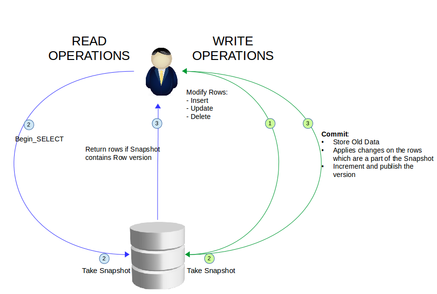

# Lock-free Queries using MVCC (multi-version concurrency control) and Snapshot Isolation for Column Tables

!!! Note
	Snapshot isolation is supported only for column tables.

As the term suggests, all queries in the system operate on a snapshot view of the database. This is, even if concurrent updates are in progress, the querying system gets a non-changing view of the state of the database at the moment in time when the query is executed. The snapshot is partition wise. The snapshot of the partition is taken the moment the query accesses the partition. This behavior is set by default for column tables and cannot be modified.

## How the Snapshot Model Works

TIBCO ComputeDB maintains a version vector for each of the table on every node. The version information for each row of the table is also maintained.

When a user query is executed, a snapshot is taken of the version vector of all the tables on the node on which the query is executed. The write operation modifies the row, increments its version while still maintaining a reference to the older version.

At the time of commit, the version information is published under a lock so that all the changes of an operation is published atomically. Older rows are cleaned periodically once it is made sure that there are no operations that require these older rows.

The read operations compare the version of each row to the ones in its snapshot and return the row whose version is same as the snapshot.

In case of failure, the versions are not published, which makes the rows invisible to any future operations. A new node joining the cluster copies all the committed rows from the existing node making sure that any snapshot will see only committed data.

The following image represents the functioning of read and write operations in the Snapshot isolation model:

By default, all individual operations (read/write) on column table have snapshot isolation with `autocommit` set to `ON`. This means, in case of a failure the user operation fails and [rollback](../reference/interactive_commands/rollback.md) is triggered.  
You cannot set [autocommit](../reference/interactive_commands/autocommit.md) to `Off`. Snapshot isolation ensures that changes made, after the ongoing operation has taken a snapshot is not visible partially or totally. 
If there are concurrent updates in a row, then the last commit is used.

!!! Note
	To get per statement transactional behavior, all the write operations can span only one partition.

	However, if you have operations that span multiple partitions, then, ensure that:

	* In case of failure on one partition, the operation is retried on another copy of the same partition. Set [redundancy](../reference/sql_reference/create-table.md) to more than 0, if transactional behavior with operations spanning more than one partition is required.

	* If the operation fails on all the redundant copies of a partition and the same operation succeeds on some of the other partitions, then, partial rollback is initiated. 
	In this case, you can retry the operation at the application level.
    

## Rollback Behavior and Member Failures

In column tables, roll back is performed in case of low memory. If the operation fails due to low memory, automatic roll back is initiated.

## Snapshot Limitations

The following limitations have been reported:

- For column tables, snapshot isolation is enabled by default, but the full range of fault tolerance is not yet implemented. It is assumed that at least one copy of a partition is always available (redundant members are available) in the event of member failures.

- Write-write conflict is not detected. The last write option is applied.

- Multi-statement is not supported.

## Snapshot Isolation with SELECT FOR UPDATE

The `SELECT FOR UPDATE` statement and other statements that implicitly place locks are not supported for column tables, and snapshot isolation is applied by default for updates. In case of multiple concurrent updates, the last update is applied.
