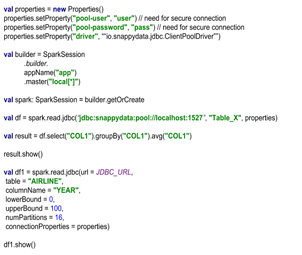

# How to Connect with JDBC Client Pool Driver
Using the JDBC client pool driver, you can connect to SnappyData and maintain an internal connection pool that provides performance improvement in point-lookup queries by reducing the cost of creating a connection again and again.

!!! Note
	  We recommend you to use the JDBC client pool driver only in smart connector and for point-lookup queries. In other scenarios, we recommend you to use the JDBC client driver.

To connect to SnappyData Cluster using JDBC client pool driver, use the url of the form:   `jdbc:snappydata:pool://<host>:<port>`

The client pool driver class name is **io.snappydata.jdbc.ClientPoolDriver**.

The following additional properties can be configured for JDBC client pool driver connection:

| Property | Description |
|--------|--------|
|    pool-user    |   The username to be passed to the JDBC client pool driver to establish a connection.   |
|pool-password|The password to be passed to the JDBC  client pool driver to establish a connection.|
|pool-initialSize|The initial number of connections that are created when the pool is started. Default value is 10.|
|pool-maxActive| The maximum number of active connections that can be allocated from this pool at a time. The default value is 100. |
|pool-minIdle| The minimum number of established connections that should be maintained in the client pool. Default value is derived from **initialSize:10**.|
|pool-maxIdle| The maximum number of connections that should be maintained in the client pool. Default value is maxActive:100. Idle connections are checked periodically, if enabled, and the connections that are idle for more than the time set in **minEvictableIdleTimeMillis** are released.|
|pool-maxWait|(int) The maximum waiting period, in milliseconds, for establishing a connection after which an exception is thrown. Default value is 30000 (30 seconds).|
|pool-removeAbandoned| Flag to remove the abandoned connections, in case they exceed the settings for **removeAbandonedTimeout**. If set to true a connection is considered abandoned and eligible for removal, if its no longer in use than the settings for **removeAbandonedTimeout**. Setting this to **true** can recover db connections from applications that fail to close a connection. The default value is **false**.|
|pool-removeAbandonedTimeout| Timeout in seconds before an abandoned connection, that was in use, can be removed. The default value is 60 seconds. The value should be set to the time required for the longest running query in your applications.|
|pool-timeBetweenEvictionRunsMillis| Time period required to sleep between runs of the idle connection validation/cleaner thread. You should always set this value above one second. This time period determines how often we check for idle and abandoned connections and how often to validate the idle connections. The default value is 5000 (5 seconds).|
|pool-minEvictableIdleTimeMillis|The minimum time period, in milliseconds, for which an object can be idle in the pool before it qualifies for eviction. The default value is 60000 (60 seconds).|
|driver|`io.snappydata.jdbc.ClientPoolDriver` This should be passed through Spark JDBC API for loading and using the driver.|

The following code snippet, shows how additional properties can be configured for JDBC client pool driver connection:

