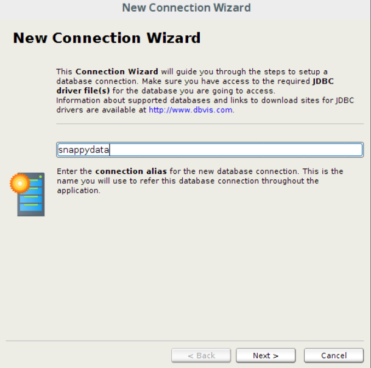
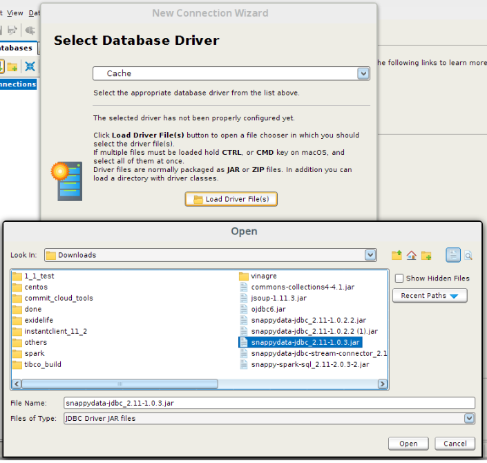
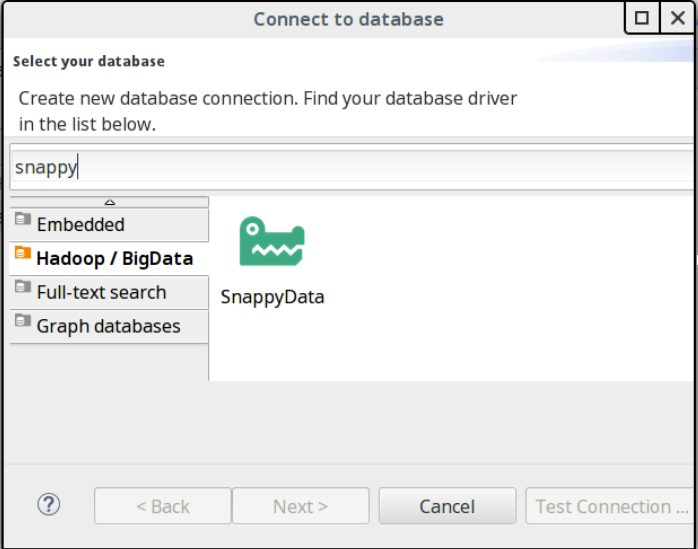
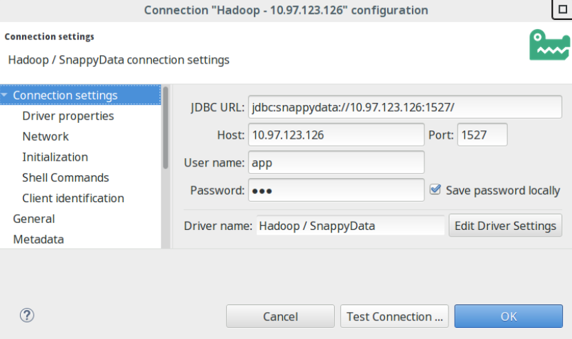
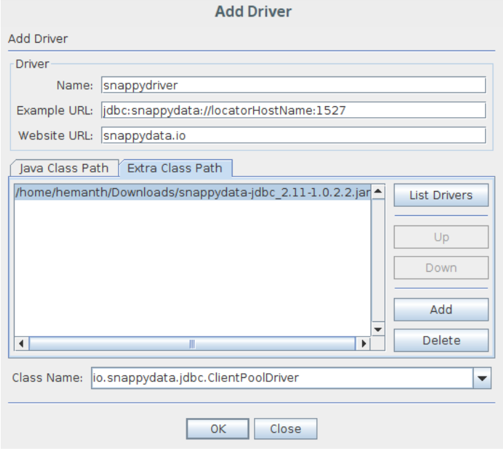
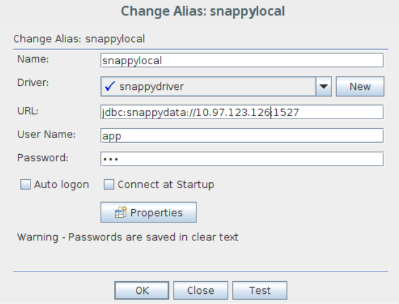

# How to Access SnappyData from Various SQL Client Tools

You can use the following SQL client tools to access TIBCO ComputeDB:

*	[DbVisualizer](#dbvis)
*	[SQL Workbench/J](#sqlworkbenchj)
*	[DBeaver](#dbeaver)
*	[SQuirreL SQL Client](#squirrel)

<a id= dbvis> </a>
## DbVisualizer
DbVisualizer is a universal database tool for developers, DBAs and analysts to access databases. You can access TIBCO ComputeDB from DbVisualizer when you create a database connection using a database driver.

To access SnappyData from DbVisualizer, do the following:

### Create a Database Driver

To create a database driver, do the following:

1.	On the DbVisualizer home page, go to **Tools** > **Driver Manager** and click **+**.
2.	Enter the following details:

	*	Name: Provide a name for the driver.
    *	URL Format: Specify the URL format as *jdbc:snappydata://server:port/*
	*	From the **Driver jar Files**, click the folder icon and select the client jar. Only after you select the client jar, the **io.snappydata.jdbc.ClientDriver** class is listed as an option in **Driver Class** drop-down list.<br> For SnappyData, this jar is located in the **build-artifacts/scala-2.11/distributions/** folder.

### Connecting to SnappyData from DbVisualizer

To connect SnappyData from DbVisualizer, do the following:

1. On the main dbviz UI, click the **Create new database** icon.<br>You are given the options to either use or not use a wizard for the connection. 
2. Click **Use Wizard**. </br> 
3. In the **New Connection** dialog box, enter a name that can be used to refer to the database connection.
4. In the **Select Database Driver** dialog box, select the database driver that you have created.</br> 
5. In the **Database URL** dialog box, type the complete URL. For example: *jdbc:snappydata://localhost:1527/*.
6. Enter the UserID and password.
7. Select the **Auto Commit** option if you want to enable auto-commit in the SQL Commander.
8. Click **Finish**.<br>You can open the SQL Commander and run your queries.

!!! Note
	The steps provided here are specific to DbVisualizer 10.0.20 version. The steps can slightly vary in other versions.

<a id= sqlworkbenchj> </a>
## SQL Workbench/J

SQL Workbench/J is a free, DBMS-independent, cross-platform SQL query tool which can be run on any operating system that provides a Java Runtime Environment. It can also work with a JDK (Java Development Kit). 

### Prerequisites

*	Install Java 8 or higher to run SQL Workbench/J. Using a 64-bit Java runtime is highly recommended.
*	Download and install SQL Workbench/J.

### Connecting to SnappyData from SQL Workbench/J

To connect SnappyData from SQL Workbench/J, do the following:

1.	Start the SnappyData cluster and Snappy shell in local mode. 
2.	Start SQL Workbench/J.  <br> If you are using Microsoft Windows®, double-click the **SQLWorkbench.exe** executable to start. If you are using a 64-bit operating system and a 64-bit Java runtime, you have to use **SQLWorkbench64.exe** instead. <br>If you are running Linux or another Unix® like operating system, you can use the supplied shell script **sqlworkbench.sh** to start the application.<br> The **Select Connection Profile** dialog box is displayed.
3.	In the **Default Group** section, enter a name for the new profile and click the **Save** icon. 
4.	Click **Manage Drivers** from the bottom left. The **Manage driver** dialog box is displayed. 
5.	Enter the following details:
	*	**Name**: Provide a name for the driver. 
	*	**Library**: Click the folder icon and select the JDBC Client jar. <br> You must download the JDBC Client jar (snappydata-jdbc_2.11-1.1.1.jar) from the SnappyData website to your local machine.
	*	**Classname**: **io.snappydata.jdbc.ClientDriver**. 
	*	**Sample** **URL**: jdbc:snappydata://server:port/
6.	Click **OK**. The **Select Connection Profile** page is displayed.
7.	Do the following:
	* Select the driver that was created.
	* Provide the URL as *jdbc:snappydata://localhost:1527/*
	* Enter username and password.
8. Click the **Test** button and then click **OK**. <br> After you get a successful connection, you run queries in SnappyData from SQL WorkBench/J.

<a id= dbeaver> </a>
## DBeaver
DBeaver is a graphical database management tool. You can access SnappyData from DBeaver. Download and install DBeaver, start the LDAP server and print the LDAP conf, and then connect to SnappyData from DBeaver.

### Download and Install DBeaver

To download and install DBeaver, do the following:

1.	Go to the [Download page](https://dbeaver.io/download/) of DBeaver.
2.	Choose an appropriate installer for the corresponding operating system. For example, for Linux Debian package, download from [this link](https://dbeaver.io/files/dbeaver-ce_latest_amd64.deb).
3.	Run the corresponding commands that are specified in the **Install** section on the Download page.

### Starting the LDAP Server

To start the LDAP server, do the following:

1.	From the terminal, go to the location of ldap-test-server: <br> `cd $SNAPPY_HOME/store/ldap-test-server`
2.	Run the following command to build: <br>`./gradlew build`
3.	Run the script: <br>`./start-ldap-server.sh auth.ldif`<br>
	This starts the LDAP server and prints the LDAP conf. The printed LDAP conf contains the username and password of LDAP that should be used to connect from DBeaver. Copy this into all the conf files of SnappyData.
4.	Start the SnappyData cluster.

### Connecting to SnappyData from DBeaver
4.	Launch DBeaver and click **New database connection**. 
5.	Select **Hadoop / Big Data** section from the left. </br>  </br> 
6.	Select SnappyData from the available list of databases and provide the following details:
	*	Hostname/IP
	*	Port
	*	Username / Password
7.	Test the connection and finish the setup of the database source.

<a id= squirrel> </a>
## SQuirreL SQL Client

The SQuirreL SQL Client client is a database administration tool that let you explore and interact with databases using a JDBC driver. You can access SnappyData from SQuirreL SQL. Download and install SQuirreL SQL Client, start the LDAP server and print the LDAP conf, and then connect to SnappyData from DBeaver.

### Download and Install SQuirrel

To download and install SQuirrel, do the following:

1.	[Download](https://sourceforge.net/projects/squirrel-sql/) SQuirreL SQL Client.
2.	Go to the folder where the SQuirreL SQL Client jar is downloaded and run the following command to install SQuirreL SQL Client:<br>
	`java -jar <downloaded squirrel jar>`
3.	Go to the SQuirreL SQL Client installation folder and run the following command:<br> 
	`./squirrel-sql.sh`
    
### Starting the LDAP Server

To start the LDAP server, do the following:

1.	From the terminal, go to the location of ldap-test-server: <br> `cd $SNAPPY_HOME/store/ldap-test-server`
2.	Run the following command: <br>`./gradlew build`
3.	Run the following script: <br>`./start-ldap-server.sh auth.ldif`
	This starts the LDAP server and prints the LDAP conf. The printed LDAP conf contains username and password of LDAP that should be used to connect from SQuirreL SQL Client. Copy this into all the conf files of SnappyData.
4.	Start SnappyData cluster.


### Connecting to SnappyData from SQuirreL SQL Client	

To connect SnappyData from SQuirreL SQL Client, do the following:

1.	Launch SQuirreL SQL Client.
2.	In the **Drivers** tab on the left side, click **+** sign to add a new driver. </br> 
2.	Provide the following details:
	*	Name
	*	Example URL(connection string)
	*	website URL
3.	Add the downloaded **snappydata jdbc jar** in the extra classpath tab and provide the class name to be used for the connection. <br>
	```
jdbc jar: https://mvnrepository.com/artifact/io.snappydata/snappydata-jdbc_2.11/1.1.1
	jdbc class: io.snappydata.jdbc.ClientPoolDriver
```
4.	Go to **Aliases** tab and then click **+** to add a new alias. </br> 
5.	Provide the following details: 
	*	Name
	*	Driver (added in step 4) 
	*	JDBC URL (For example: jdbc:snappydata:pool://localhost:1527)
	*	Username and password: (Default username / password: app/app)
6.	Test the connection and finish setup.
	You can run the following test queries:

            create table colTable(CustKey Integer not null, CustName String) using column options();
            insert into colTable values(1, 'a');
            insert into colTable values(2, 'a');
            insert into colTable values(3, 'a');
            select count(*) from colTable;
            create table rowTable(CustKey Integer NOT NULL PRIMARY KEY,  CustName String) using row options();
            insert into rowTable values(11, 'a');
            insert into rowTable values(22, 'a');
            insert into rowTable values(33, 'a');
            update rowTable set CustName='d' where custkey = 1;
            select * from rowTable order by custkey;
            drop table if exists rowTable;
            drop table if exists colTable;
            show tables;


!!!Note
	When connecting to SnappyData, if a SQL client tool sets JDBC autocommit to false and transaction isolation level such as read committed or repeatable read is used,  the unsupported operations such as those on column table will produce an error - **Operations on column tables are not supported when query routing is disabled or autocommit is false.**   In such cases, connection property **allow-explicit-commit=true** can be used in the connection URL to avoid this error. Refer to configuration parameters section <add a link to the section> for details on this property. For example,  JDBC URL: **jdbc:snappydata://locatoHostName:1527/allow-explicit-commit=true** 


