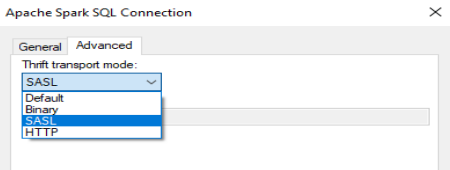
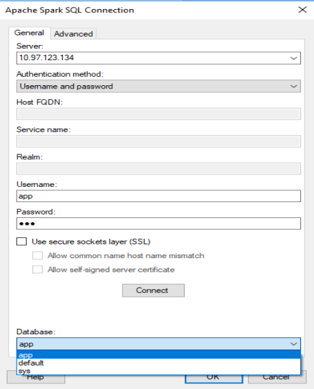

# How to Connect TIBCO Spotfire® Desktop to TIBCO ComputeDB™

#### Lizy, note: this would work for both the enterprise ComputeDB product or Project SnappyData (open source). 

TIBCO Spotfire® Desktop allows users to easily author and update ad-hoc analytics, applications, and dashboards. 
To connect TIBCO Spotfire® Desktop to TIBCO ComputeDB, setup and launch the TIBCO ComputeDB cluster. 

#### <jags>: -- this should work for other Spotfire options too (fwik): Spotfire analyst, spotfire server and spotfire cloud. Maybe, it is best to leave our description as TIBCO Spotfire ... others should comment. 

## Download and launch TIBCO ComputeDB
Do the following, in the given order, to set up TIBCO ComputeDB.

#### <Jags> -- why do we need this section? note that the Hive thrift server is now enabled, by default. Instead of providing instructions for product setup here, simply providing a link to the appropriate section ... we have several options ... AWS, on-prem, docker, etc. Any of these options can be used. 

1.	Check the [system requirements](/install/system_requirements.md) to install and run TIBCO ComputeDB. 
2.	Download the Enterprise Edition from the Release page.
3.	[Configure the TIBCO ComputeDB Cluster](/configuring_cluster/configuring_cluster.md).
4.	In the [Lead Node Configuration](/configuring_cluster/configuring_cluster.md#lead), set the following property to enable the Hive Thrift server: `-snappydata.hiveServer.enabled=true`.
#### <jags> -- defaults to true now ... but, this option should be covered in the product docs. It adds an additional 10 seconds to the startup time and folks may want to turn it off too. Is the Hive thrift server covered elsewhere ? 

5.	If you want to securely access the Hive Thrift server using SSL encryption, you must set these additional properties in the [Lead Node Configuration](/configuring_cluster/configuring_cluster.md#lead):
	*	`-hive.server2.use.SSL=true` 
    *	`-hive.server2.k-hive.server2.use.SSL=trueeystore.path=<keystore-file-path>` 
    *	`-hive.server2.keystore.password=<keystore file password>`
#### <jags> -- same comment. If there is another section on Hive thrift server mention the above there. Provide a link here. 
    
    For more details about setting the Hive Thrift server, refer to [placeholder].
    
6.	Launch the cluster   `./sbin/snappy-start-all.sh`

## Connecting Spotfire® Desktop to TIBCO ComputeDB

Login and download TIBCO Spotfire® Desktop from the [TIBCO eDelivery website]( https://edelivery.tibco.com/storefront/eval/tibco-spotfire-desktop/prod10954.html). Follow the setup guidelines to install the product. After installation, you can use the following steps to connect Spotfire® Desktop to TIBCO ComputeDB.

1.	On the Spotfire® Desktop application, from the left panel, click **Connect to** > **Apache Spark SQL** > **New Connection**.   The **Apache Spark SQL Connection** dialog box is displayed.  
3.	In the **General** tab, enter the following details:
	*	**Server**: Enter the hostname/IP of the Lead node in TIBCO ComputeDB cluster
#### <Jags> -- the Hive2 thrift server uses port 10000 by default. If the port# is explicitly configured then, you must specify the port# like this: <IP or Hostname>:<port#>
	*	**Authentication** **Method**: Select **username and password** option.
	*	**Username/Password**: Provide a username and password. You could choose to use APP/APP for username/password if authentication was not configured in the cluster.
4.	Select the **Use secure sockets layer** check box if you want to securely access the Hive Thrift server. Else, you can clear the check box.

	!!! Note
    	Ensure to configure the lead node with additional properties for securely accessing the Hive Thrift server with SSL encryption. See [Setting TIBCO ComputeDB](#tibcomputsetup). 
        
5.	Click the **Advanced** tab and set the **Thrift transport mode** to **SASL**.   
6.	Go to **General** tab and then click the **Connect** button.
7.	From the **Database** dropdown, either choose the existing database (schema) **app** or **default** or you can choose a database (schema) that is created in the TIBCO ComputeDB cluster.    
8.	Click **OK**. The **View In Connection (VIC)** box is displayed which lists the tables from the selected database.

