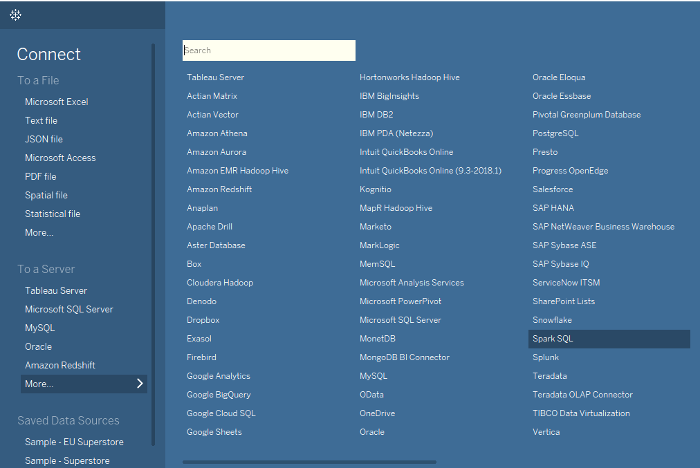
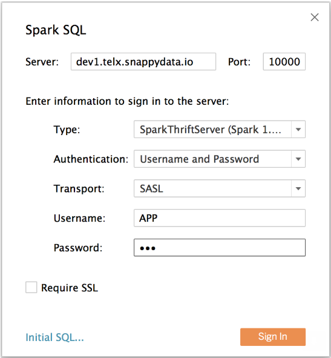

# How to Connect Tableau to SnappyData

To connect Tableau to SnappyData, you must download and install SnappyData Enterprise Version 1.0.2.1.

Use the following steps to connect Tableau to SnappyData:

## Step 1: Enable Hive Server in SnappyData Cluster
1. Download and Install the SnappyData Enterprise version 1.0.2.1 from the [SnappyData Release page](https://github.com/SnappyDataInc/snappydata/releases). 
2.	[Configure the SnappyData Cluster](../configuring_cluster/configuring_cluster.md).
3.	In the [Lead node configuration](../configuring_cluster/configuring_cluster.md#configuring-leads), set the following property: `snappydata.hiveServer.enabled=true`
4.	Launch the SnappyData cluster.  `./sbin/snappy-start-all.sh`

##Step 2: Connect to Tableau Desktop
1.	Download and install **Tableau Desktop v2018.3.x** from the [Tableau Download page](https://www.tableau.com/support/releases/online/2018.3). You may also need to register your product.
2. Open the Tableau Desktop application, on the left panel, from the **To A Server **section, select **Spark SQL connector** option. 
	
3. In the **Spark SQL** configuration dialog box, enter the following details:

	
    
    *	Enter the host/IP of the Lead node in SnappyData cluster. The default port used by the Hive thrift server is 10000.
    *	Select **SparkThriftServer** option from **Type** dropdown.
    *	Select **username and password** option from the **Authentication** dropdown.
    *	Set **Transport** field to **SASL**.
    *	Provide a username/password. You could choose to use **APP/APP** for username/password if authentication was not configured in the cluster.

    !!! Note
		For more information about Spark SQL configurations, click [here](https://onlinehelp.tableau.com/current/pro/desktop/en-us/examples_sparksql.htm).

4. Click the **Sign In **button to connect to SnappyData. Tableau displays the page where you can browse and select Schema and Tables as per your requirements to create data visualizations.

	!!! Note
    	The **Sign In** button is disabled if Simba Spark ODBC Driver is not already installed on your system.  To enable it, click the **Download and Install the drivers **link and install Simba Spark ODBC Driver. Now the **Sign in** button is enabled.

