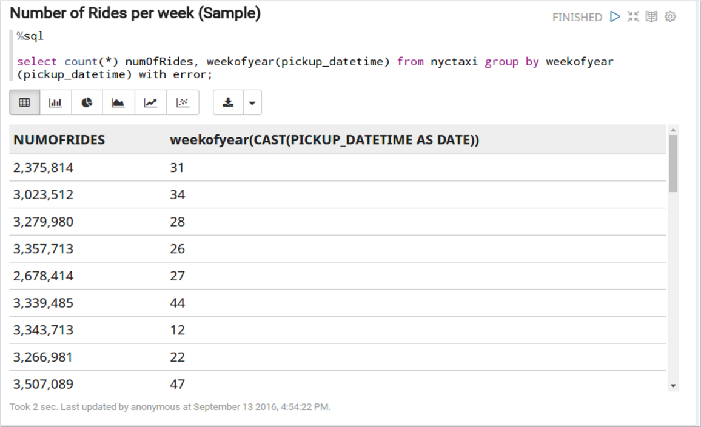

##Creating Notebooks - Try it Yourself!

1. Log on to Apache Zeppelin, create a notebook and insert a new paragraph.
2. Use `%snappydata.spark` for SnappyData interpreter or use `%snappydata.sql` for SQL interpreter.
3. Download a dataset you want to use and create tables as mentioned below

###Examples of Queries and Results
This section provides you with examples you can use in a paragraph.

* In this example, you can create tables using an external Dataset from AWS S3.

* In this example, you can execute a query on a base table using the SQL interpreter. It returns the number of rides per week. 

* In this example, you can execute a query on a sample table using the SQL interpreter. It returns the number of rides per week

* In this example, you are processing data using the SnappyData Scala interpreter.

* Apache Zeppelin allows you to dynamically create input fields. To create a text input field, use `${fieldname}`.
In this example, the input forms are, ` ${taxiin=60} or taxiout > ${taxiout=60}`

