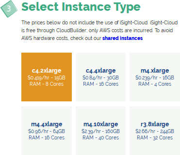
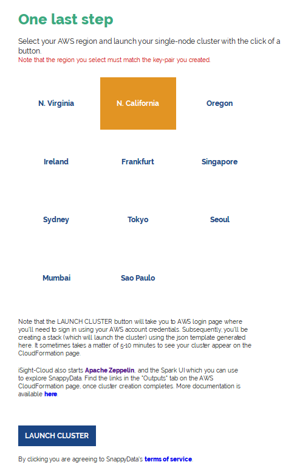
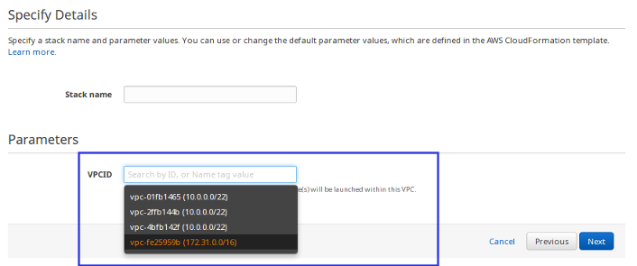
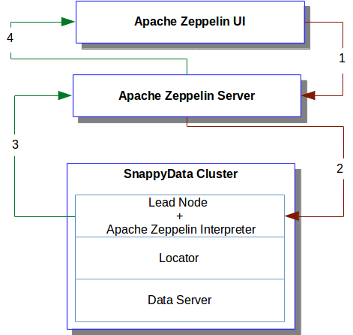
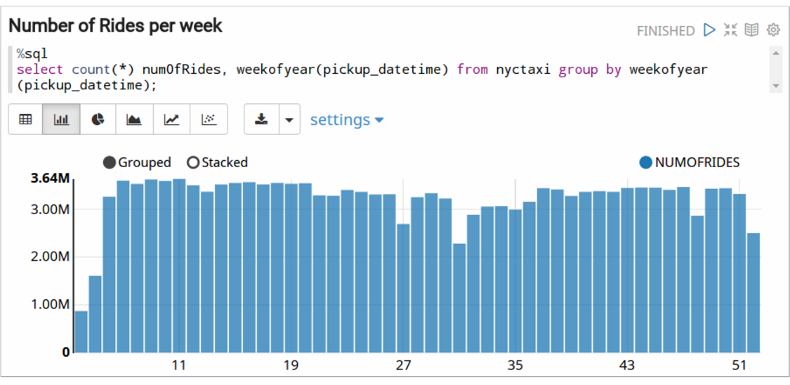

# Quick Start Steps

To understand the product follow these easy steps that can get you started quickly:

1. [Setting up SnappyData Cloud Cluster](#SettingUp)

	* [Deploying SnappyData Cloud Cluster with iSight CloudBuilder](#DeployingClusterCloudFormation)

	* [Deploying SnappyData Cloud Cluster on AWS using Scripts](#DeployingClusterScript)

2. [Using Apache Zeppelin](#LoggingZeppelin)	

	* [Using Predefined Notebook](#predefinednotebook)

	* [Creating your own Notebook](#Creatingnotebook)

3. [Loading Data from AWS S3](#dataAWSS3)

4. [Monitoring SnappyData Cloud Cluster](#Monitoring)

<a id="SettingUp"></a>
## Setting Up SnappyData Cloud Cluster
This section discusses the steps required for setting up and deploying SnappyData Cloud Cluster on AWS using the iSight CloudBuilder and using a script.

<a id="DeployingClusterCloudFormation"></a>
## Deploying SnappyData Cloud Cluster with iSight CloudBuilder
Watch the following  video to learn how easy it is to use iSight CloudBuilder, which generates a SnappyData Cloud Cluster.

[](https://www.youtube.com/watch?v=jbudjTqWsdI&feature=youtu.be)

### Prerequisites
Before you begin:

* Ensure that you have an existing AWS account with required permissions to launch EC2 resources with CloudFormation

* Sign into the AWS console using your AWS account-specific URL. This ensures that the account-specific URL is stored as a cookie in the browser, which then redirects you to the appropriate AWS URL for subsequent logins.

* Create an EC2 Key Pair in the region where you want to launch the SnappyData Cloud cluster


SnappyData uses the AWS CloudFormation feature to automatically install, configure and start a SnappyData Cloud cluster. In this release, the configuration supports launching the cluster on a single EC2 instance.

It is recommended that you select an instance type with higher processing power and more memory for this cluster, as it would be running four processes (locator, lead, a data server and an Apache Zeppelin server) on it.

This method is recommended as the fastest way to deploy SnappyData. All you need is an existing AWS account and login credentials to get started! 

### Configuring and Launching the SnappyData Cloud Cluster

Launch the iSight CloudBuilder from [http://www.snappydata.io/cloudbuilder](http://www.snappydata.io/cloudbuilder). 

1. Enter the name for your cluster. Each cluster is identified by its unique name. 
The names and details of the members are automatically derived from the provided cluster name. <br>


2. Enter a name of an existing EC2 KeyPair. This enables SSH access to the cluster.
Refer to the Amazon documentation for more information on  [generating your own EC2 Key Pair](http://docs.aws.amazon.com/AWSEC2/latest/UserGuide/ec2-key-pairs.html).<br>


3. Select an instance based on the capacity that you require. </br>

 
4. Enter the size of the EBS storage volume to be attached to the Amazon EC2 instance in the **EBS Volume Size(gigabytes)** field.</br>


	!!! Note
    	Currently only Amazon Elastic Block Storage (EBS) is supported.

5. Enter your email address.  <br>


6. Click **Generate**.

7. On the next page, select the AWS region, and then click **Launch Cluster** to launch your single-node cluster.

    !!! Note

		* The region you select must match the EC2 Key Pair you created.

		* If you are not already logged into AWS, you are redirected to the AWS sign-in page. 	


8. On the **Select Template** page, the URL for the Amazon S3 template is pre-populated. Click **Next** to continue.   <br>


9. On the **Specify Details** page:

	* **Stack name**: You can change the stack name.</br>

	!!! Note 
    	The stack name must contain only letters, numbers, dashes and should start with an alpha character.
    
    * **VPCID**: From the drop-down list, select the Virtual Private Cloud (VPC) ID that is set as default. Your instances will be launched within this VPC.

    Click **Next** to continue.
    
    

10. Specify the tags (key-value pairs) for resources in your stack or leave the field empty and click **Next**.

11. On the **Review** page, verify the details and click **Create** to create a stack.

	!!! Note: 
    	This operation may take a few minutes to complete.

12. The next page lists the existing stacks. Click **Refresh** to view the updated list and the status of the stack creation.
When the cluster has started, the status of the stack changes to **CREATE_COMPLETE**. <br>

<a id="Stack"></a>
13. Click on the **Outputs** tab, to view the links (URL) required for launching Apache Zeppelin, which provides web-based notebooks for data exploration. <br>
	

	!!! Note: 
    	If the status of the stack displays **ROLLBACK_IN_PROGRESS** or **DELETE_COMPLETE**, the stack creation may have failed. Some common problems that might have caused the failure are:

		* **Insufficient Permissions**: Verify that you have the required permissions for creating a stack (and other AWS resources) on AWS.

		* **Invalid Keypair**: Verify that the EC2 key pair exists in the region you selected in the iSight CloudBuilder creation steps.

		* **Limit Exceeded**: Verify that you have not exceeded your resource limit. For example, if you exceed the allocated limit of Amazon EC2 instances, the resource creation fails and an error is reported.*

!!! Note: 
	To stop incurring charges for the instance, you can either terminate the instance or delete the stack. You cannot connect to or restart an instance after you have terminated it.


For more information, refer to the [Apache Zeppelin](#LoggingZeppelin) section or refer to the [Apache Zeppelin documentation](http://zeppelin.apache.org/).

<a id="DeployingClusterScript"></a>
## Deploying SnappyData Cloud Cluster on AWS using Scripts

SnappyData provides a script that allows you to launch and manage SnappyData clusters on Amazon Elastic Compute Cloud (EC2).

Download the script from the latest [SnappyData Release page](https://github.com/SnappyDataInc/snappydata/releases).
The package is available in compressed files (**snappydata-ec2-`<version>`.tar.gz**). Extract the contents to a location on your computer.

### Prerequisites
Before you begin, do the following:

* Ensure that you have an existing AWS account with required permissions to launch EC2 resources.

* EC2 Key Pair is created in the region where you want to launch the SnappyData cluster.

* Using the AWS Secret Access Key and the Access Key ID, set the two environment variables, `AWS_SECRET_ACCESS_KEY` and `AWS_ACCESS_KEY_ID`.

	If you already have set up the AWS Command Line Interface on your local machine, the script automatically detects and uses the credentials from the AWS credentials file. You can find this information from the AWS IAM console.

	For example:<br/>
>```
export AWS_SECRET_ACCESS_KEY=abcD12efGH34ijkL56mnoP78qrsT910uvwXYZ1112
export AWS_ACCESS_KEY_ID=A1B2C3D4E5F6G7H8I9J10
>```

* Ensure Python v 2.7 or later is installed on your local computer.

### Launching SnappyData Cluster

In the command prompt, go to the directory where the **snappydata-ec2-`<version>`.tar.gz** is extracted or to the **aws/ec2** directory where the **snappy-cloud-tools** [repository](https://github.com/SnappyDataInc/snappy-cloud-tools) is cloned locally.

Enter the command in the following format:

```
./snappy-ec2 -k <your-key-name> -i <your-keyfile-path> <action> <your-cluster-name>
```

Here, `<your-key-name>` refers to the EC2 Key Pair, `<your-keyfile-path>` refers to the path to the key file and `<action>` refers to the action to be performed (for example, launch, start, stop).
 
By default, the script starts one instance of a locator, lead,  and server each. 
The script identifies each cluster by the unique cluster name (you provided) and internally ties members (locators, leads, and stores/servers) of the cluster with EC2 security groups.
 
The names and details of the members are automatically derived from the provided cluster name. 

For example, if you launch a cluster named **my-cluster**, the locator is available in security group named **my-cluster-locator** and the store/server are available in **my-cluster-store**.

When running the script you can also specify properties like the number of stores and region.
For example, using the following command, you can start a SnappyData cluster named **snappydata-cluster** with 2 stores (or servers) in the N. California (us-west-1) region on AWS. It also starts an Apache Zeppelin server on the instance where lead is running.

The examples below assume that you have the key file (my-ec2-key.pem) in your home directory for EC2 Key Pair named 'my-ec2-key'.

```
./snappy-ec2 -k my-ec2-key -i ~/my-ec2-key.pem --stores=2 --with-zeppelin=embedded --region=us-west-1 launch snappydata-cluster 
```
To start Apache Zeppelin on a separate instance, use `--with-zeppelin=non-embedded`. 

For a comprehensive list of command options, simply run `./snappy-ec2` in the command prompt.

<a id="dataAWSS3"></a>
## Loading Data from AWS S3
SnappyData provides you with predefined buckets which contain datasets. When data is loaded, the table reads from the files available at the specified external location (AWS S3). 


!!! Note
    * 	The Amazon S3 buckets and files are private by default. Ensure that you set the permissions required to make the data publicly accessible. Please refer to the [documentation provided by Amazon S3](http://docs.aws.amazon.com/AmazonS3/latest/dev/UsingBucket.html) for detailed information on creating a bucket, adding files and setting required permissions.

	* 	You can also find AWS related information on the AWS homepage, from the **Account** > **Security Credentials** > **Access Credentials** option.

	* 	Information related to the Bucket Name and Folder Location can be found on the AWS S3 site.

	* 	If the Secret Access Key contains a slash, it causes the Spark job to fail. When you create the Secret Access Key, ensure that it only contains alpha-numeric characters. 

	* 	When reading or writing CSV/Parquet to and from S3, the *ConnectionPoolTimeoutException* error may be reported. To avoid this error, in the Spark context, set the value of the `fs.s3a.connection.maximum` property to a number greater than the possible number of partitions. </br> For example, `snc.sparkContext.hadoopConfiguration.set("fs.s3a.connection.maximum", "1000")`

	* 	To access data from AWS S3, copy the **aws-java-sdk-`<version_number>`** and **hadoop-aws-`<version_number>`** files (available in the Maven repository), to the **jars** directory (snappydata-`<version_number>`-bin/jars) in the SnappyData home directory. 


To define a table that references the data in AWS S3, create a paragraph in the following format:

```
%sql
DROP TABLE IF EXISTS <table_name> ;
CREATE EXTERNAL TABLE <table_name> USING parquet OPTIONS(path 's3a://<AWS_ACCESS_KEY_ID>:<AWS_SECRET_ACCESS_KEY>@<bucket_Name>/<folder_name>');
```

The values are:

**Property** | **Description/Value**
---------------|-----------------------------
```<table_name>``` |The name of the table
```<AWS_SECRET_ACCESS_KEY>:<AWS_ACCESS_KEY_ID> ```| Security credentials used to authenticate and authorize calls that you make to AWS. 
```<bucket_Name> ```| The name of the bucket where the folder is located. Default value: zeppelindemo 
```<folder_name>``` | The folder name where the data is stored. Default value: nytaxifaredata 

<a id="LoggingZeppelin"></a>
## Using Apache Zeppelin

Apache Zeppelin provides web-based notebooks for data exploration. A notebook consists of one or more paragraphs, and each paragraph consists of a section each for code and results.
Launch Apache Zeppelin from the web browser by accessing the host and port associated with your Apache Zeppelin server. For example, http://`<zeppelin_host>`:`<port_number>`. The welcome page which lists existing notebooks is displayed.  
SnappyData provides predefined notebooks which are displayed on the home page after you have logged into Apache Zeppelin. For more information, see [Using Predefined Notebooks](#predefinednotebook).

Refer to the [Apache Zeppelin documentation](http://zeppelin.apache.org/), for more information.

### Functioning of the SnappyData Interpreter and SnappyData Cluster

 1. When you execute a paragraph in the Apache Zeppelin UI, the query is sent to the Apache Zeppelin Server.
 
 2. The query is then received by the SnappyData Interpreter which is running on the Lead node in the cluster.

 3. When the query has completed execution, the results are sent from the SnappyData Interpreter (which is running on the Lead node) to the Apache Zeppelin server.

 4. Finally, the results are displayed in the Zeppelin UI. 

Connecting the SnappyData Interpreter to the SnappyData cluster is represented in the below figure.



## Using the Interpreter
SnappyData Interpreter group consists of the interpreters `%snappydata.spark` and `%snappydata.sql`.
To use an interpreter, add the associated interpreter directive with the format, `%<Interpreter_name>` at the beginning of a paragraph in your note. In a paragraph, use one of the interpreters, and then enter required commands.

!!! Note:
    	*	The SnappyData Interpreter provides a basic auto-completion functionality. Press (Ctrl+.) on the keyboard to view a list of suggestions.

        * 	It is recommended that you use the SQL interpreter to run queries on the SnappyData cluster, as an out of memory error may be reported with running the Scala interpreter. 

        * 	Each paragraph has its own SnappyData context. When you set a property on one paragraph, the property is applicable only to that paragraph and not to other paragraphs in the notebook.


## SQL Interpreter
The `%snappydata.sql` code specifies the default SQL interpreter. This interpreter is used to execute SQL queries on SnappyData cluster.

### Multi-Line Statements
Multi-line statements ,as well as multiple statements on the same line, are also supported as long as they are separated by a semicolon. However, only the result of the last query is displayed.

SnappyData provides a list of connection-specific SQL properties that can be applied to the paragraph that is executed. 

In the following example, `spark.sql.shuffle.partitions` allows you to specify the number of partitions to be used for this query:

```
%sql
set spark.sql.shuffle.partitions=6; 
select medallion,avg(trip_distance) as avgTripDist from nyctaxi group by medallion order by medallion desc limit 100 with error
```
### SnappyData Directives in Apache Zeppelin
You can execute approximate queries on SnappyData cluster by using the `%sql show-instant-results-first` directive. 
In this case, the query is first executed on the sample table and the approximate result is displayed, after which the query is run on the base table. Once the query is complete, the approximate result is replaced with the actual result.

In the following example, you can see that the query is first executed on the sample table, and the time required to execute the query is displayed. 
At the same time, the query is executed on the base table, and the total time required to execute the query on the base table is displayed.
```
%sql show-instant-results-first
select avg(trip_time_in_secs/60) tripTime, hour(pickup_datetime), count(*) howManyTrips, absolute_error(tripTime) from nyctaxi where pickup_latitude < 40.767588 and pickup_latitude > 40.749775 and pickup_longitude > -74.001632 and  pickup_longitude < -73.974595 and dropoff_latitude > 40.716800 and  dropoff_latitude <  40.717776 and dropoff_longitude >  -74.017682 and dropoff_longitude < -74.000945 group by hour(pickup_datetime);
```


!!! Note: 
	This directive works only for the SQL interpreter and an error may be displayed for the Scala interpreter.

## Scala Interpreter
The `%snappydata.spark` code specifies the default Scala interpreter. This interpreter is used to write Scala code in the paragraph.
SnappyContext is injected in this interpreter and can be accessed using variable **snc**.

<a id="predefinednotebook"></a>

## Using Predefined Notebooks
SnappyData provides you predefined notebooks **NYCTAXI Analytics** and **Airline Data Analytics** which contains definitions that are stored in a single file. 

When you launch Apache Zeppelin in the browser, the welcome page displays the existing notebooks. Open a notebook and run any of the paragraphs to analyze data and view the result. 

<a id="Creatingnotebook"></a>

## Creating Notebooks - Try it Yourself!

1. Log on to Apache Zeppelin, create a notebook and insert a new paragraph.

2. Use `%snappydata.spark` for SnappyData interpreter or use `%snappydata.sql` for SQL interpreter.

3. Download a dataset you want to use and create tables as mentioned below

### Examples of Queries and Results
This section provides you with examples you can use in a paragraph.

* In this example, you can create tables using an external Dataset from AWS S3.


* In this example, you can execute a query on a base table using the SQL interpreter. It returns the number of rides per week. 



* In this example, you can execute a query on a sample table using the SQL interpreter. It returns the number of rides per week


* In this example, you are processing data using the SnappyData Scala interpreter.


* Apache Zeppelin allows you to dynamically create input fields. To create a text input field, use `${fieldname}`.
In this example, the input forms are, ` ${taxiin=60} or taxiout > ${taxiout=60}`


<a id="Monitoring"></a>
## Monitoring the SnappyData Cloud Cluster
 You can monitor the SnappyData cluster using the Apache Spark Console. This enables you to observe and record the performance and the activities on the SnappyData cluster.

<!--The SnappyData Pulse Console provides a graphical dashboard which helps you monitor vital, real-time health and performance of SnappyData clusters, members, and tables. 
It provides information on the health, operational and configuration data, system alerts, CPU, disk and memory usage, throughput performance and statistics for system members like locators, leads, stores/servers, connected clients etc.  
It also displays data information for various tables created in the cluster on different nodes/members along with their statistics.
-->
The Apache Spark Console displays useful information about SnappyData. This includes a list of scheduler stages and tasks, summary of tables and memory usage.

## Accessing the Console
To access the Apache Spark console from the Apache Zeppelin notebook: 

1. Click on the **Spark UI** <!--or **Pulse** -->link provided in the paragraph.
	
<!--2. For the SnappyData Pulse console, enter the default login credentials "admin" as both the username and password.-->
3. Once you have logged in, you can start monitoring the SnappyData cluster. 

