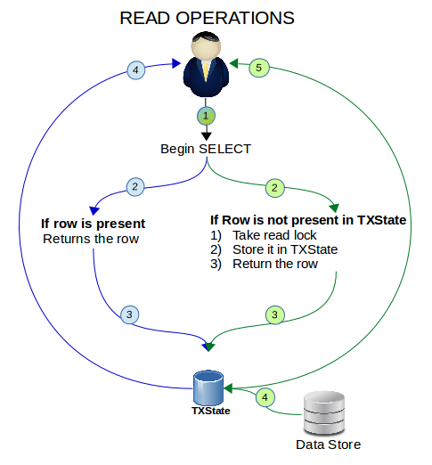

# How Transactions Work for Row Tables

!!! Note:
	Distributed transaction is supported only for row tables.

There is no centralized transaction coordinator in SnappyData. Instead, the member on which a transaction was started acts as the coordinator for the duration of the transaction. If the application updates one or more rows, the transaction coordinator determines which owning members are involved, and acquires local "write" locks on all of the copies of the rows. At commit time, all changes are applied to the local store and any redundant copies. If another concurrent transaction attempts to change one of the rows, the local "write" acquisition fails for the row, and that transaction is automatically rolled back.

Unlike traditional distributed databases, SnappyData does not use write-ahead logging for transaction recovery in case the commit fails during replication or redundant updates to one or more members. The most likely failure scenario is one where the member is unhealthy and gets forced out of the distributed system, guaranteeing the consistency of the data. When the failed member comes back online, it automatically recovers the replicated/redundant data set and establishes coherency with the other members. If all copies of some data go down before the commit is issued, then this condition is detected using the group membership system, and the transaction is rolled back automatically on all members.

!!! Note:
	SnappyData does not support transactions while new data store members are added while in progress. If you add a new member to the cluster in the middle of a transaction and the new member is involved in the transaction (e.g. owns a partition of the data or is a replica), SnappyData implicitly rolls back the transaction and throws a SQLException (SQLState: "X0Z05").

The following images represent the functioning of read and write operations in the transaction model:

## Using Transactions for Row Tables

Transactions specify an [isolation level](../../reference/sql_reference/set-isolation.md) that defines the degree to which one transaction must be isolated from resource or data modifications made by other transactions. The transaction isolation levels define the type of locks acquired on read operations. Only one of the isolation level options can be set at a time, and it remains set for that connection until it is explicitly changed.

!!! Note:

	* If you set the isolation level to `READ_COMMITTED` or `REPEATABLE_READ`, queries on column table report an error if [autocommit](../../reference/interactive_commands/autocommit.md) is set to off (false).  Queries on column tables are supported when isolation level is set to `READ_COMMITTED` or `REPEATABLE_READ` and autocommit is set to **true**.

    * DDL execution (for example [CREATE TABLE](../../reference/sql_reference/create-table.md) /[DROP TABLE](../../reference/sql_reference/drop-table.md)) is not allowed when `autocommit` is set to `false`  and transaction isolation level is `READ_COMMITTED` or `REPEATABLE_READ`.  DDL commands reports syntax error in such cases. DDL execution is allowed if `autocommit` is `true` for `READ_COMMITTED` or `REPEATABLE_READ` isolation levels.

The following isolation levels are supported for row tables:

| Isolation level | Description |
|--------|--------|
|NONE|Default isolation level. The Database Engine uses shared locks to prevent other transactions from modifying rows while the current transaction is running a read operation. |
|READ_COMMITTED|SnappyData ensures that ongoing transactional as well as non-transactional (isolation-level NONE) operations never read uncommitted (dirty) data. SnappyData accomplishes this by maintaining transactional changes in a separate transaction state that are applied to the actual data-store for the table only at commit time. SnappyData detects only Write-Write conflicts while in READ_COMMITTED isolation level.  In READ COMMITTED, a read view is created at the start of each statement and lasts only as long as each statement execution.|
|REPEATABLE_READ|In this isolation level, a lock-based concurrency control DBMS implementation keeps read and write locks (acquired on selected data) until the end of the transaction. In REPEATABLE READ every lock acquired during a transaction is held for the duration of the transaction.|

For more information, see, [SET ISOLATION](../../reference/sql_reference/set-isolation.md)
