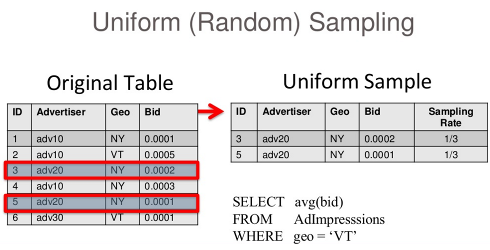
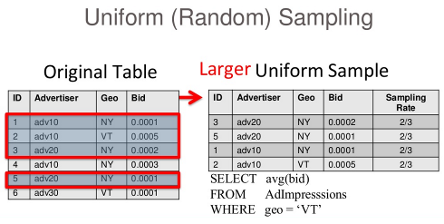
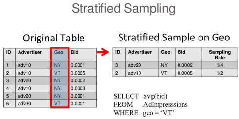

# Key Concepts

TIBCO ComputeDB SDE relies on two methods for approximations - **Stratified Sampling** and **Sketching**. A brief introduction to these concepts is provided below.

##  Stratified Sampling
Sampling is quite intuitive and commonly used by data scientists and explorers. The most common algorithm in use is 'uniform random sampling'. As the term implies, the algorithm is designed to randomly pick a small fraction of the population (the full data set). The algorithm is not biased on any characteristics in the data set. It is totally random and the probability of any element being selected in the sample is the same (or uniform). But, uniform random sampling does not work well for general purpose querying.

Take this simple example table that manages AdImpressions. If random sample is created that is a third of the original size two records is picked in random. 
This is depicted in the following figure:

If a query is executed, like 'SELECT avg(bid) FROM AdImpresssions where geo = 'VT'', the answer is a 100% wrong. The common solution to this problem could be to increase the size of the sample. 

But, if the data distribution along this 'GEO' dimension is skewed, you could still keep picking any records or have too few records to produce a good answer to queries. 

Stratified sampling, on the other hand, allows the user to specify the common dimensions used for querying and ensures that each dimension or strata have enough representation in the sampled data set. For instance, as shown in the following figure, a sample stratified on 'Geo' would provide a much better answer. 

To understand these concepts in further detail, refer to the [handbook](https://web.eecs.umich.edu/~mozafari/php/data/uploads/approx_chapter.pdf). It explains different sampling strategies, error estimation mechanisms, and various types of data synopses.

## Online Sampling
SDE also supports continuous sampling over streaming data and not just static data sets. For instance, you can use the Spark DataFrame APIs to create a uniform random sample over static RDDs. For online sampling, SDE first does [reservoir sampling](https://en.wikipedia.org/wiki/Reservoir_sampling) for each startum in a write-optimized store before flushing it into a read-optimized store for stratified samples. 
There is also explicit support for time series. For instance, if AdImpressions are continuously streaming in, TIBCO ComputeDB can ensure having enough samples over each 5-minute time window, while still ensuring that all GEOs have good representation in the sample.

## Sketching
While stratified sampling ensures that data dimensions with low representation are captured, it still does not work well when you want to capture outliers. For instance, queries like 'Find the top-10 users with the most re-tweets in the last 5 minutes may not result in good answers. Instead, other data structures like a Count-min-sketch are relied on to capture data frequencies in a stream. This is a data structure that requires that it captures how often an element is seen in a stream for the top-N such elements. 
While a [Count-min-sketch](https://en.wikipedia.org/wiki/Count%E2%80%93min_sketch) is well described, SDE extends this with support for providing top-K estimates over time series data. 
